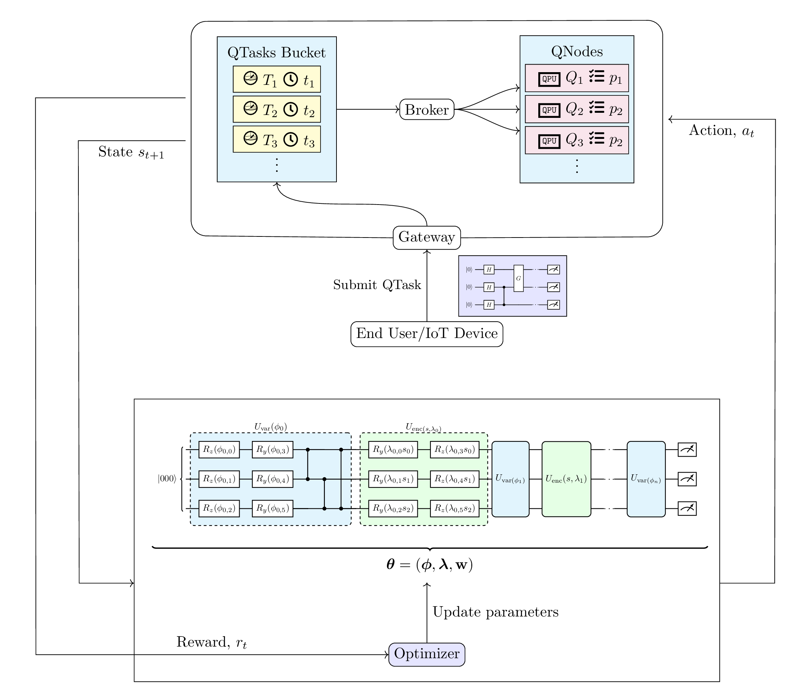
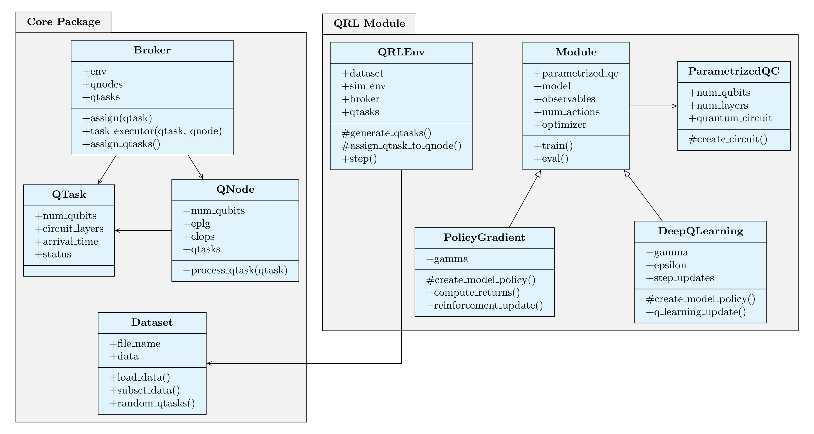

# QAISim

### A Toolkit for Modeling and Simulation of AI in Quantum Cloud Computing Environments

This repository provides the official implementation for the paper:

> **QAISim: A Toolkit for Modeling and Simulation of AI in Quantum Cloud Computing Environments**\
> Irwindeep Singh, Sukhpal Singh Gill, Jinzhao Sun, Jan Mol\
> Published: _[Cluster Computing (Springer), 2026](https://link.springer.com/article/10.1007/s10586-025-05879-9)_ | [ArXiv](https://arxiv.org/abs/2512.17918v1)

### Overview

QAISim is a Python-based simulation toolkit designed for resource management in quantum cloud computing environments using Quantum Artificial Intelligence (QAI). It aims to optimize total execution time by leveraging advanced reinforcement learning techniques. QAISim implements Policy Gradient and Deep Q-Learning methods using Parametrized Quantum Circuits (PQCs) and provides performance comparisons with heuristic baselines and classical RL counterparts. The toolkit is modular, extensible, and suitable for experimentation and evaluation of QRL based resource management strategies.

<p align="center">
  <br>
  <em>Figure 1: QAISim architecture.</em>
</p>

### Features

- **Quantum Cloud Simulation:** Simulation of a quantum cloud computing environment for RL using simpy and gymnasium.
- **Parametrized Quantum Circuits:** Implementation of parametrized quantum circuits for reinforcement learning.
- **Quantum Reinforcement Learning:** Implementation of Policy Gradient and Deep-Q-Learning algorithms used with parametrized quantum circuits.
- **Noise Simulation:** Supports noise simulation in PQC using amplitude damping and depolarization channels.
- **Modular Toolkit:** Easily extend or modify the code to experiment with different PQCs or RL algorithms.

### Repository Structure

```bash
.
├── data
├── eval.py
├── qaisim            # this implements the core QAISim package
│   ├── broker.py
│   ├── __init__.py
│   ├── qnode.py
│   ├── qrl           # this implements all the QRL modules
│   ├── qtask.py
│   ├── tests
│   └── utils.py
├── requirements.txt
├── results           # all results from training and evaluation go here
│   ├── dq_learning
│   └── policy
├── train_classical
├── train_dql
└── train_policy

```

<p align="center">
  <br>
  <em>Figure 2: Fundamental Classes of QAISim.</em>
</p>

### Requirements

1. **Clone the Repository:**

   ```bash
   git clone https://github.com/Irwindeep/QAISim.git
   cd QAISim
   ```

2. **Set Up Python Environment:**\
   QAISim requires Python 3.11. Experiments in the paper were conducted using Python 3.11.9.\
   If Python 3.11 is not available, install it using a Python version manager or the official Python installer.
3. **Set Up a Virtual Environment (Optional):**
   ```bash
   python3 -m venv venv
   source venv/bin/activate  # On Windows use: venv\Scripts\activate
   ```
4. **Install Dependencies:**
   ```bash
   pip install -r requirements.txt
   ```

### Usage

- **Model Training:**\
  Training scripts for all models are provided as `train_policy`, `train_dql` and `train_classical`. Example Usage:

  ```bash
  ./train_policy      # On Windows: python train_policy
  ./train_dql         # On Windows: python train_dql
  ./train_classical   # On Windows: python train_classical
  ```

  For noisy experiments, use:

  ```bash
  ./train_policy \
      --backend noisy --num_layers 1 \
      --num_episodes 150 --batch_size 2

  ./train_dql \
      --backend noisy --num_layers 1 \
      --num_episodes 150 --batch_size 2

  ```

  All trained models will be saved in `results/` directory.

- **Model Evaluation:**\
  Evaluation script for all models is provided as `eval.py`. This script evaluates and compares all the models on cumulative reward and execution time.

### Citation

If you find the code useful for your research, please cite our paper:

```bibtex
@article{singh2026qaisim,
    title={{QAISim}: a toolkit for modeling and simulation of {AI} in quantum cloud computing environments},
    author={Singh, Irwindeep and Gill, Sukhpal Singh and Sun, Jinzhao and Mol, Jan},
    journal={Cluster Computing},
    volume={29},
    number={2},
    pages={99},
    year={2026},
    publisher={Springer}
}
```
